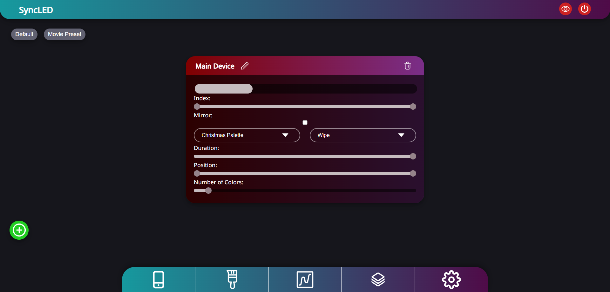
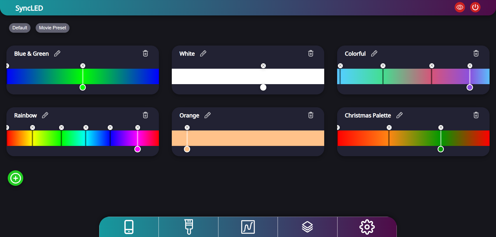
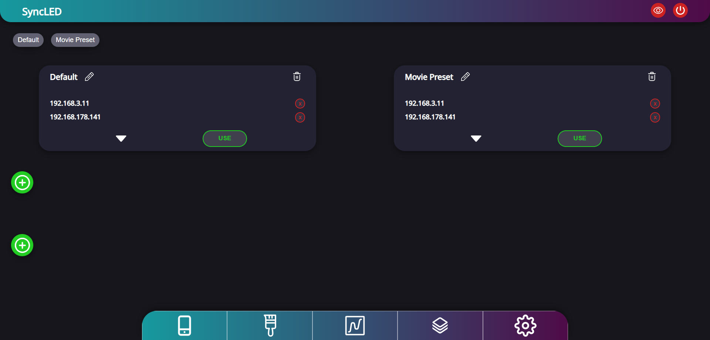
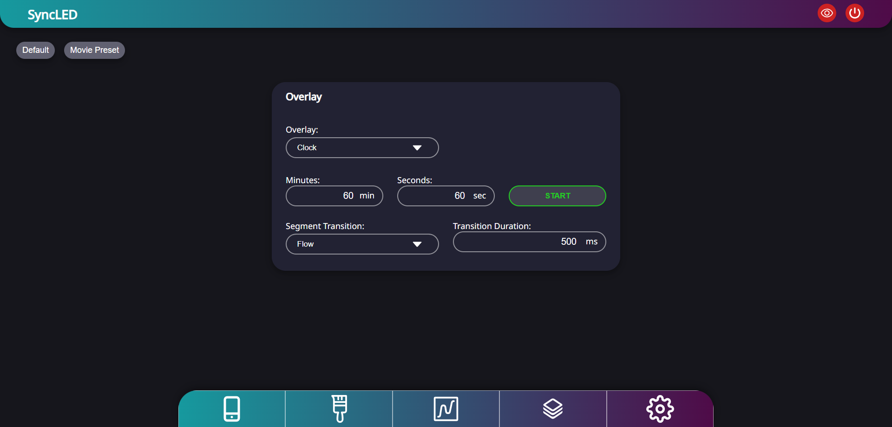
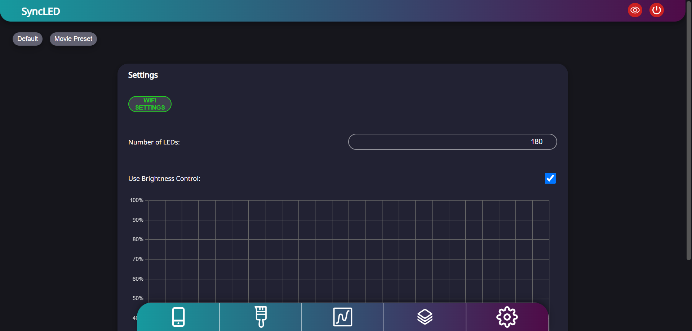

# SyncLED

An ESP8266/ESP32 based LED controller with focus on usability, customization and synchronizantion. It can control NeoPixel (WS2812B) LEDs over a modern web interface.

## Features

- Lots of effects
- Fully customizable color palettes
- Multiple effects and palettes through virtual devices
- Save presets and playlists and sync them with other SyncLEDs
- Automatic time synchronization with other SyncLEDs
- Access Point for initial configuration and as a fallback
- 2D effects for LED matrices
- 7 Segment Display options (Time, Countdown, ...)
- Auto Brightness for daytime dependent brightness
- Stream from other software (Hyperion, Audio-reactive-led, ...)

## Parts needed
- ESP8266 / ESP32 microcontroller
- LED strip (WS2812B)
- 5V Power Supply with **enough wattage**
- 5V to 3.3V Regulator (or go the cheap way and just use 2 diodes)

## Hardware Setup
- Connect the LED strip power wires and the Regulator to the Power Supply
- Connect the microcontroller to the Regulator
- Connect the data wire of the LED strip to the TX0 pin of the microcontroller

## Installation
- Clone the project
- Open the project in PlatformIO using VS Code
- Upload the code using the Upload Task
- Upload the additional data with the ***Little FS upload plugin***

After the upload is completed and the microcontroller booted, you should be able to see a new WiFi AP called "**SyncLED #...**". Connect to it and the setup wizzard should appear.

## The Web Interface

---
Create and configure virtual devices on a single physical LED strip using the LED indices on the strip.\
Each virtual device behaves like an individual controller. Effect, color palette and individual parameters can be chosen.

---
Create individual color palettes for each situation.\
Color palettes can even be synchronized to other SyncLED instances to enable seamless integration.

---
Custom presets lets you save different configurations of you LEDs that you like.\
A preset not only exists on the local device. Multiple SyncLED instances can be added to a preset to save the configuration of your whole setup.\
Furthermore playlists can be created to cycle through different presets.

---
The software natively supports overlays for LED clocks.\
Different settings are available to configure your clock to your preferences.

---
The buildin settings let you configure the WiFi settings and the number of LEDs in use.\
Furthermore an automatic brightness feature lets you set a custom brightness curve over the cycle of a day.
